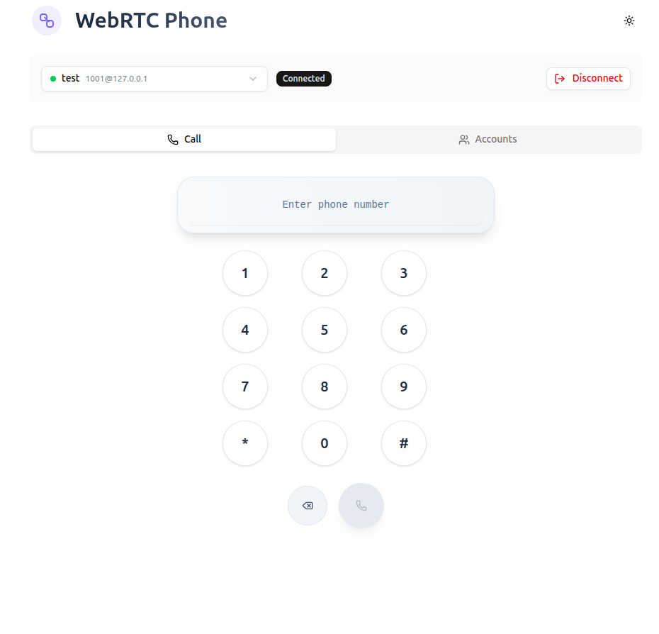
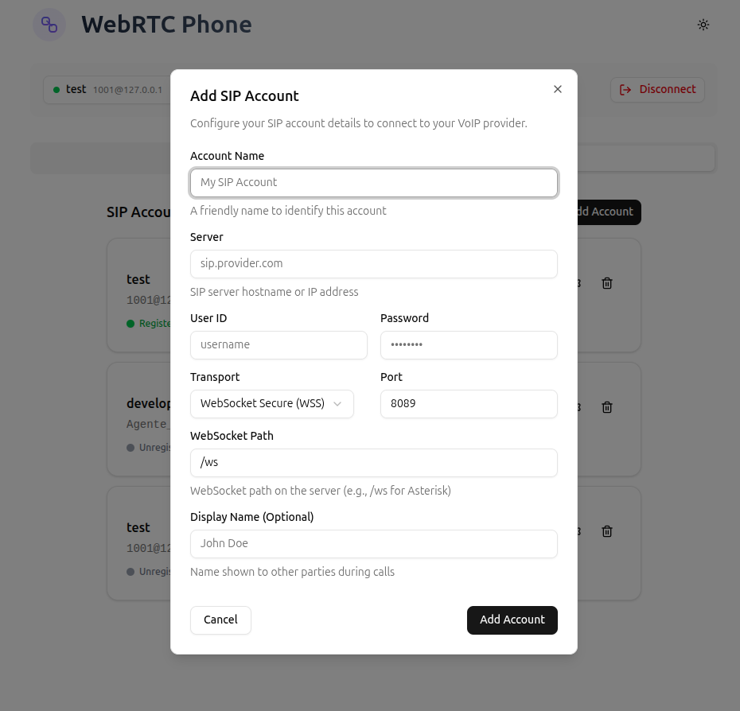
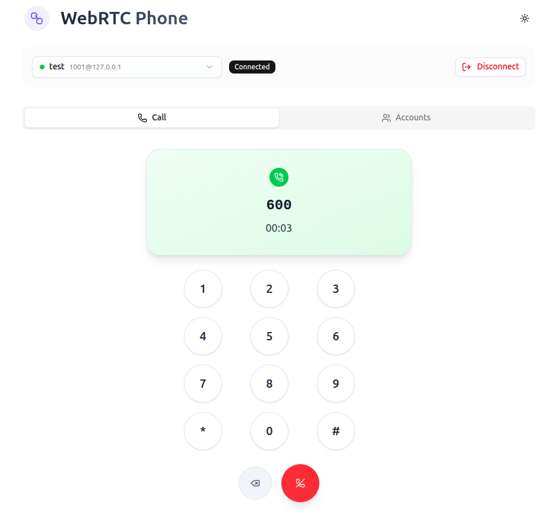
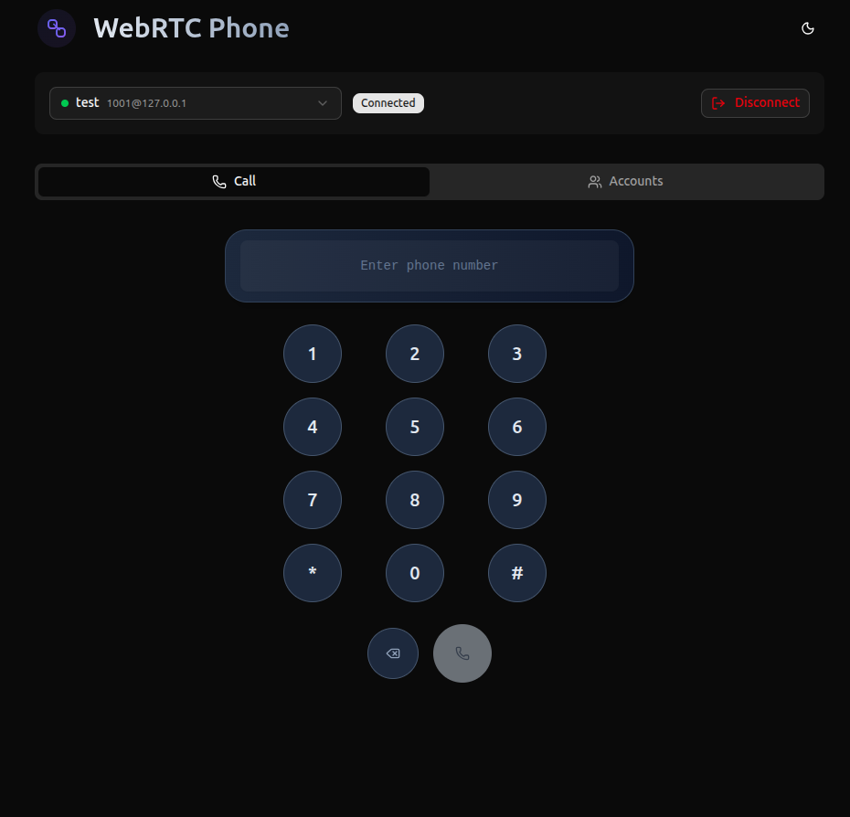

<div align="center">


# 📞 WebRTC Phone

_A modern WebRTC-based SIP phone for VoIP communications_

[](https://reactjs.org/)
[](https://www.typescriptlang.org/)
[](https://tailwindcss.com/)
[](https://ui.shadcn.com/)
[](https://jssip.net/)
[](https://webrtc.org/)

A clean, minimal, and beautiful WebRTC-based SIP phone built with modern web technologies. Make calls from your browser with WebSocket connectivity and an intuitive interface that just works.

[🚀 Get Started](#-getting-started) • [✨ Features](#-features) • [🛠️ Tech Stack](#%EF%B8%8F-tech-stack) • [📱 Screenshots](#-screenshots)

</div>

---

## ✨ Features

- **🎯 Minimal Design** — Clean, distraction-free interface focused on making calls
- **🔄 Smooth Animations** — Fluid transitions between input and call states
- **📱 Responsive Layout** — Works beautifully on desktop and mobile devices
- **🎨 Modern UI** — Built with Radix UI components and Tailwind CSS
- **⚡ WebRTC-Powered** — Real-time SIP calling with WebSocket connectivity
- **🔧 Account Management** — Easy SIP account configuration and switching
- **🌙 Dark Mode Ready** — Automatic theme support
- **🎨 shadcn/ui Components** — Beautiful, accessible UI components
- **📞 Call Controls** — Intuitive dialpad with call/hangup functionality
- **🔌 WebSocket Support** — WS and WSS transport protocols only

## 🚀 Getting Started

### Prerequisites

- Node.js 18+
- A SIP provider account (VoIP service)

### Installation

```bash
# Clone the repository
git clone https://github.com/mirkobertone/webrtc-phone.git

# Navigate to the project directory
cd webrtc-phone

# Install dependencies
pnpm install

# Start the development server
pnpm dev
```

### Configuration

1. Open the application in your browser
2. Navigate to the **Accounts** tab
3. Add your SIP account details:

   - **Name**: A friendly name for your account
   - **User ID**: Your SIP username
   - **Password**: Your SIP password
   - **Server**: Your SIP server address
   - **Port**: SIP server port (default: 8088 for WS, 8089 for WSS)
   - **Transport**: WebSocket protocol (WS or WSS only)
   - **WebSocket Path**: Path on the server (e.g., /ws)

4. Click **Connect** to register your account
5. Switch to the **Call** tab and start making calls!

## 🛠️ Tech Stack

- **Frontend**: React 19 + TypeScript
- **Styling**: Tailwind CSS 4 + shadcn/ui
- **Components**: Radix UI primitives via shadcn/ui
- **SIP**: JsSIP WebRTC Library
- **Transport**: WebSocket (WS/WSS) only
- **Build Tool**: Vite
- **Icons**: Lucide React
- **Forms**: React Hook Form + Zod

## 📱 Screenshots

<div align="center">

### Call Interface



_Clean dialpad with smooth animations and modern UI_

### Account Management



_Simple SIP account configuration with WebSocket settings and URI preview_

### Active Call



_Minimal call status display with call controls_

### Dark Mode



_Beautiful and minimal dark theme_

</div>

## 🎨 Design Philosophy

WebRTC Phone follows a **"less is more"** approach:

- **Single Purpose** — Focused solely on making and receiving calls
- **Unified Interface** — One element that transforms between input and call status
- **Smooth Transitions** — Every interaction feels natural and responsive
- **Clean Aesthetics** — Minimal visual noise, maximum usability
- **Modern Web Standards** — Built for the web with WebRTC and WebSocket technologies

## 🤝 Contributing

Contributions are welcome! Please feel free to submit a Pull Request.

1. Fork the project
2. Create your feature branch (`git checkout -b feature/AmazingFeature`)
3. Commit your changes (`git commit -m 'Add some AmazingFeature'`)
4. Push to the branch (`git push origin feature/AmazingFeature`)
5. Open a Pull Request

## 📄 License

This project is licensed under the MIT License - see the [LICENSE](LICENSE) file for details.

## 🙏 Acknowledgments

- [shadcn/ui](https://ui.shadcn.com/) - Beautiful component system built on Radix UI
- [JsSIP](https://jssip.net/) - WebRTC SIP library
- [Radix UI](https://www.radix-ui.com/) - Accessible component primitives
- [Tailwind CSS](https://tailwindcss.com/) - Utility-first CSS framework
- [Lucide](https://lucide.dev/) - Beautiful icon library

---

<div align="center">

**A modern WebRTC phone** 📞

Made with ❤️ for simple, web-based communication

</div>
